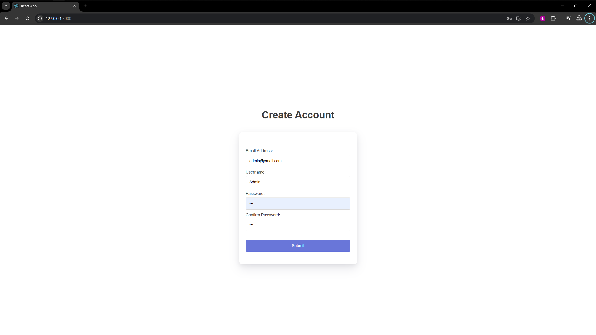
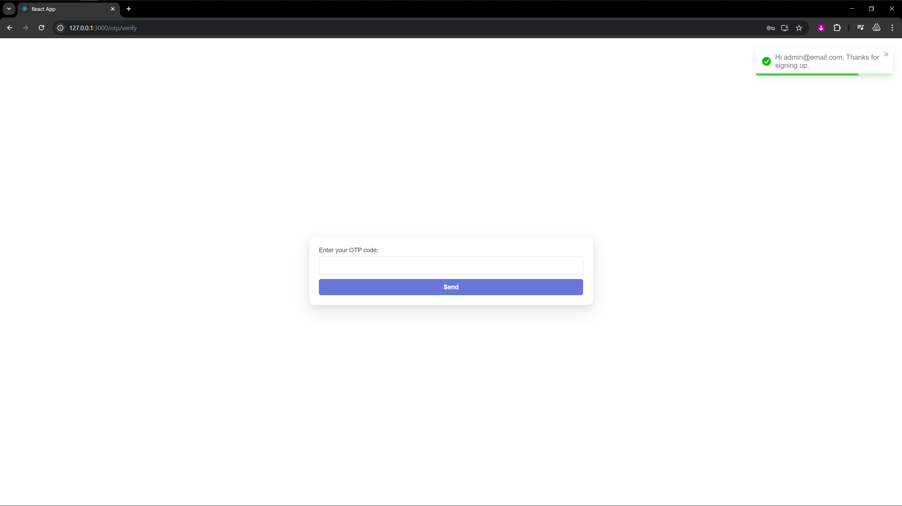
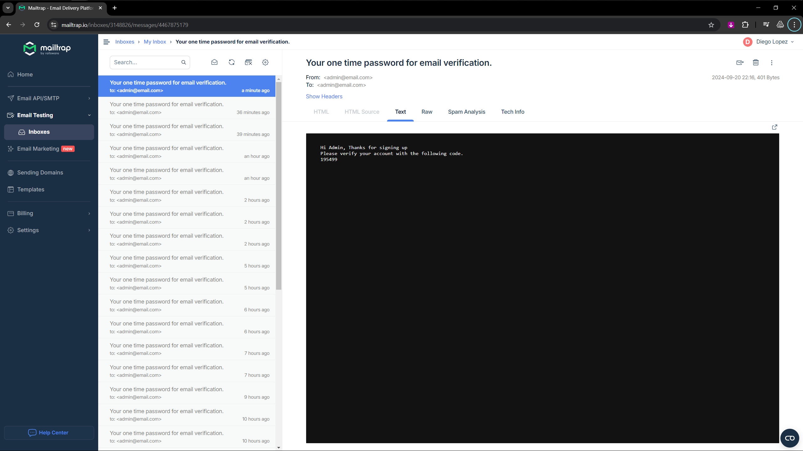
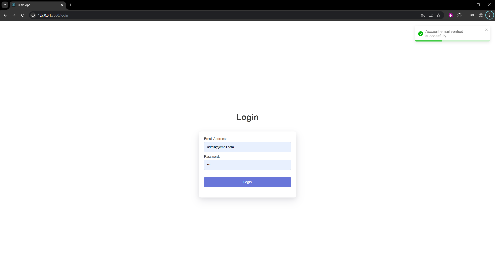

# NexosSoftware - Technical Challenge
[](https://github.com/0100-0100/NexosSoftware/actions/workflows/actions.yml)
#### This is the repository storing the codebase of the technical test sent in by Nexos Software - Colombia on September 18 2024

---
The most recent docker images available have been used in the project as well as local development done in Ubuntu 24.04 with WSL.
You can find the version of packages and specific dependencies on the corresponding package management files.
- [Python - requirements.txt](./backend/requirements.txt)
- [React TypeScript - package.json](./frontend/package.json)

Python3.12 - Django - Django Rest Framework - Docker - Node - TypeScript - Axios - NGINX - React - Tailwind.css

### This is a Single Page Web application project using the following technologies:
- Django Backend App Server
- PostgreSQL Database Server
- Redis Cache Server
- TypeScript React Frontend App Server
- NGINX Frontend WebServer

### Full implementation of user auth flows with the use of simpleJWT package for Django:
- SignUp
- Email OTP Verification
- Email Password Reset
- Login
- Logout


## Installation and How to run?:
### 1
You need to setup a .env file on the root of the project so that docker the current environment variables are configured.
``` bash
    POSTGRES_ENGINE='django.db.backends.postgresql'
    POSTGRES_DB='django_backend_db'
    POSTGRES_USER='django_backend_user'
    POSTGRES_PASSWORD='123'
    POSTGRES_PORT='5432'
    ROOT_POSTGRES_PASSWORD='1234'

    POSTGRES_HOST='postgres'
    REDIS_HOST='redis'

    # Check section mailtrap.io for info on how to setup outbound email testing and validation.
    EMAIL_HOST='sandbox.smtp.mailtrap.io'
    EMAIL_HOST_USER=''
    EMAIL_HOST_PASSWORD=''
    DEFAULT_FROM_EMAIL='admin@email.com'
    EMAIL_PORT='2525'
    EMAIL_USE_TLS=True
```

### 2
Clone the repository and execute the provided script ./docker.sh
You can also execute all the following docker commands manually:
``` bash
    docker stop $(docker ps -a -q) 2>>/dev/null;
    docker rm $(docker ps -a -q) 2>>/dev/null;
    docker compose pull && docker compose build && docker compose up
```
Take into account that by running these commands you will stop and removem all the currently active docker containers.

The compose.yaml file includes configurations for initializing the PostgreSQL Database Server in order to be ready for Django,
Here you can see the init.sql file used for the postgres container:
``` sql
CREATE DATABASE django_backend_db;
CREATE USER django_backend_user WITH ENCRYPTED PASSWORD '123';
ALTER ROLE django_backend_user SET client_encoding TO 'utf8';
ALTER ROLE django_backend_user SET default_transaction_isolation TO 'read committed';
ALTER ROLE django_backend_user SET timezone TO 'UTC';
GRANT ALL PRIVILEGES ON DATABASE django_backend_db TO django_backend_user;
\c django_backend_db
GRANT ALL ON SCHEMA public TO django_backend_user;
```

# Mailtrap
Once you create an account on https://mailtrap.io/ you will be able to generate the email credentials in order to test the emails sent for verification
in order for an user to authenticate with the web application.

# Overview:
## Signup Page

## Verify with received email one time password Page

## Mailtrap

## Verified Page

